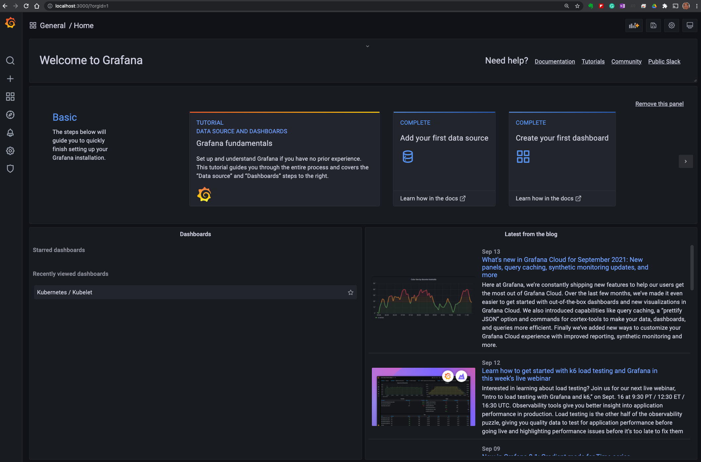
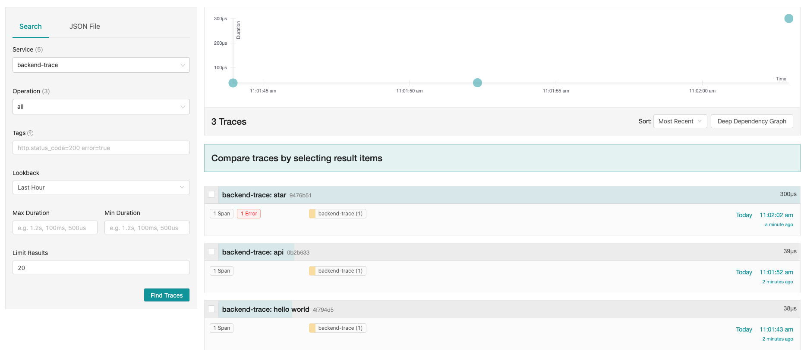
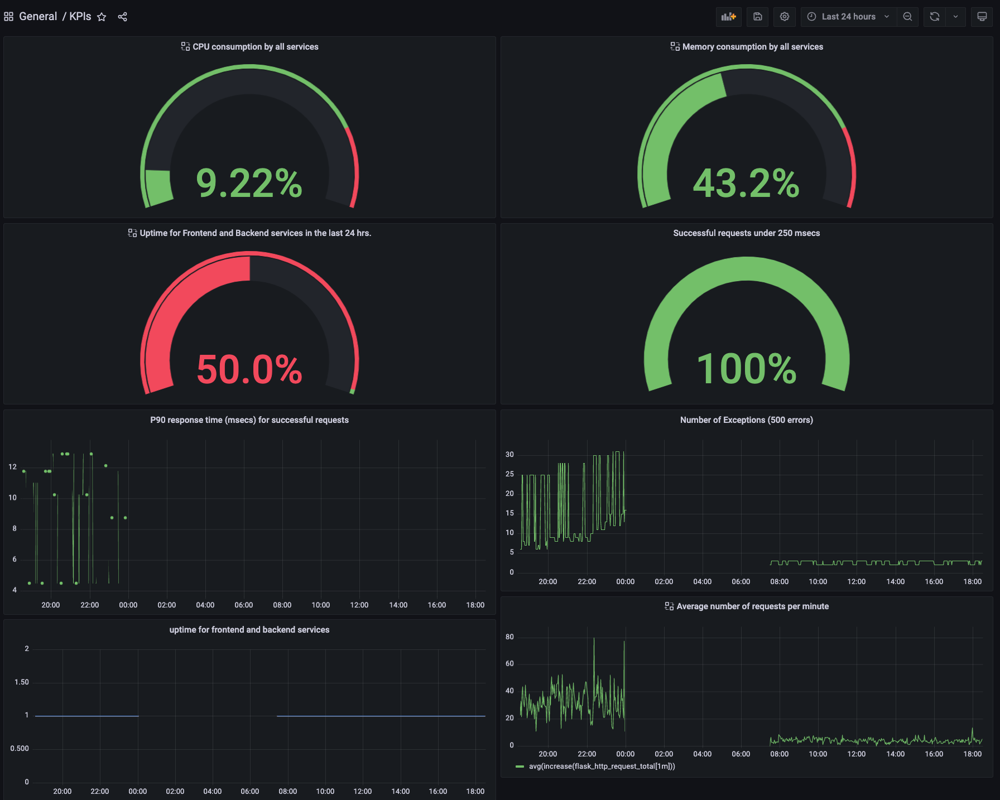

**Note:** For the screenshots, you can store all of your answer images in the `answer-img` directory.

## Verify the monitoring installation

*TODO:* run `kubectl` command to show the running pods and services for the three components. Copy and paste the output or take a screenshot of the output and include it here to verify the installation

## Setup the Jaeger and Prometheus source
*TODO:* Expose Grafana to the internet and then setup Prometheus as a data source. Provide a screenshot of the home page after logging into Grafana.

## Create a Basic Dashboard
*TODO:* Create a dashboard in Grafana that shows Prometheus as a source. Take a screenshot and include it here.

## Describe SLO/SLI
*TODO:* Describe, in your own words, what the SLIs are, based on an SLO of *monthly uptime* and *request response time*.

SLIs are a defined set of measurements that we can use to demonstrate the SLO is met. For an SLO of monthly uptime and request response time, I would use SLIs such as:

- percentage of infrastructure uptime in a month
- percentage of request response time that is less than 250 milliseconds in a month
- percentage of CPU and memory consumption

## Creating SLI metrics.
*TODO:* It is important to know why we want to measure certain metrics for our customer. Describe in detail 5 metrics to measure these SLIs. 

I would follow the "4 Golden Signals" guideline and system uptime:

1. **Latency** — The time taken to serve a request (usually measured in ms).
2. **Traffic** — The amount of stress on a system from demand (such as the number of HTTP requests/second).
3. **Errors** — The number of requests that are failing (such as number of HTTP 500 responses).
4. **Saturation** — The overall capacity of a service (such as the percentage of memory or CPU used).
5. **Uptime** — The percentage of system availability during a defined period (such as 1 day or 1 month).

## Create a Dashboard to measure our SLIs
*TODO:* Create a dashboard to measure the uptime of the frontend and backend services We will also want to measure to measure 40x and 50x errors. Create a dashboard that show these values over a 24 hour period and take a screenshot.

## Tracing our Flask App
*TODO:*  We will create a Jaeger span to measure the processes on the backend. Once you fill in the span, provide a screenshot of it here.

## Jaeger in Dashboards
*TODO:* Now that the trace is running, let's add the metric to our current Grafana dashboard. Once this is completed, provide a screenshot of it here.

## Report Error
*TODO:* Using the template below, write a trouble ticket for the developers, to explain the errors that you are seeing (400, 500, latency) and to let them know the file that is causing the issue.

TROUBLE TICKET

Name: Backend service is showing 500 errors for the star endpoint

Date: Sept 27, 2021

Subject: MongoDB issues in Backend service

Affected Area: The /star endpoint in Backend service

Severity: critical

Description: The MongoDB has not been set up correctly for the /star endpoint in Backend service. We need to develop and test the deployment manifest.

## Creating SLIs and SLOs
*TODO:* We want to create an SLO guaranteeing that our application has a 99.95% uptime per month. Name three SLIs that you would use to measure the success of this SLO.

To demonstrate the success of achieving the SLO for 99.95% application uptime per month, I would measure 3 of the "Four Golden Signals", namely:

1. Percentage of CPU and memory consumption in the last 1 month (for saturation)
2. Percentage of Infrastructure uptime in the last 1 month (for traffic)
3. Percentage of request response time less than 250 milliseconds (for latency)

## Building KPIs for our plan
*TODO*: Now that we have our SLIs and SLOs, create KPIs to accurately measure these metrics. We will make a dashboard for this, but first write them down here.

For demonstration purposes, I would collect KPIs for a 24 hours period.

1. CPU consumption should be less than 80%
2. Memory consumption should be less than 80%
3. Percentage of infrastructure uptime should be higher than 99.99%
4. Percentage of request response time less than 250 milliseconds should be higher than 99.99%

## Final Dashboard
*TODO*: Create a Dashboard containing graphs that capture all the metrics of your KPIs and adequately representing your SLIs and SLOs. Include a screenshot of the dashboard here, and write a text description of what graphs are represented in the dashboard.  

